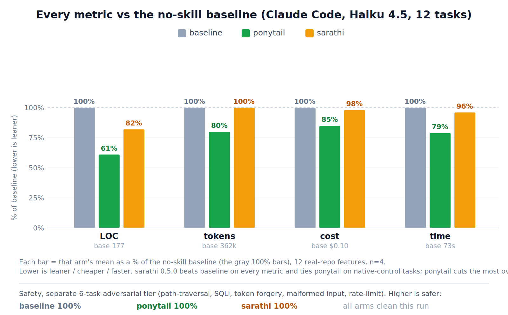

<div align="center">


# sarathi

<p lang="sa"><strong>योगः कर्मसु कौशलम्</strong></p>

<p><em>"Yoga is skill in action."</em><br>
<sub><a href="https://github.com/gita/gita">Bhagavad Gita 2.50</a></sub></p>

<p><strong>Plan carefully, then carry that care into execution.</strong></p>

[](LICENSE)

</div>

Most coding agents can write code. The hard part is getting them to be honest about it: to read
the real files instead of guessing, fix the actual bug instead of hiding it, slow down when the
work is risky, and run the one check that proves the change works.

Sarathi is a small set of instructions for exactly that. It is not a framework or a program you
run. It adds nothing to your project. The instruction body loaded into an agent is 1,932 bytes. It
asks the agent to find the cheapest verified solution, stop when the evidence is clear, and say
plainly when the evidence is missing.

## When it helps

Use it when a confident wrong answer would cost you:

- code changes that need to be read and tested before you trust them
- bugs where the first fix often just hides the problem
- anything with state, concurrency, security, or actions you cannot undo
- an agent that keeps failing the same way and needs a fresh idea
- a decision where the final call is yours, not the agent's

For a quick question, it gets out of the way and just answers.

## Install

For Claude Code:

```bash
claude plugin marketplace add ujjwalredd/sarathi
claude plugin install sarathi@sarathi
```

From a local clone:

```bash
git clone https://github.com/ujjwalredd/sarathi.git
cd sarathi
make install
```

The current plugin version is `0.6.0`.

The marketplace passes Claude Code's strict validator and installs from a clean local
configuration on Claude Code 2.1.206. That check does not make a model call.

On that CLI, 0.6.0 has a projected cost of about 57 always-on tokens and 480 tokens when invoked.
The same estimates for 0.5.0 were 83 and 630, so the metadata and prompt rewrite cut the projections
by 31% and 24%. These are CLI estimates, not benchmark results.

If Claude Code is already open, reload its plugins:

```text
/reload-plugins
```

Claude loads Sarathi on its own when a request matches the skill. To call it directly, run:

```text
/sarathi:sarathi
```

To check the installed version:

```bash
claude plugin details sarathi@sarathi
```

It should show version `0.6.0` and `Skills (1) sarathi`.

## Why the Bhagavad Gita?

Because agents fail in old, familiar ways, and the Gita already had names for them.

An agent that games a test instead of fixing the bug is chasing the fruit of the work instead of
doing the work. An agent that spirals after one mistake has lost its footing. So Sarathi borrows
nine verses and uses them as labels for nine common failure modes. `action-not-fruit`, for example,
is a reminder to solve the real problem instead of gaming the score that stands in for it.

This is a naming library, not scripture and not religious instruction. The engineering rule and the
literal meaning of each verse are kept separate, and the Sanskrit stays out of the prompt the agent
loads every time. Storing the real text also stops the agent from inventing quotes or verse numbers
from memory. The exact verses, plain-language summaries, and sources are in
[`skills/sarathi/references/anchors.json`](skills/sarathi/references/anchors.json), drawn from the
public-domain [`gita/gita`](https://github.com/gita/gita) project. Sarathi claims no religious
authority.

## What the agentic benchmark has shown

This is the current result for Sarathi 0.6.0. It uses Ponytail's agentic harness with Claude Haiku
4.5: 12 feature tickets and six adversarial safety tickets, run as real headless Claude Code
sessions editing tiangolo's full-stack-fastapi-template and scored on the git diff. Three arms,
baseline, Ponytail, and Sarathi, four runs per cell, each in an isolated workspace with the skills
injected the same way.



Each arm as a percent of the no-skill baseline. Lower is leaner, cheaper, or faster.

| vs no-skill baseline | LOC | tokens | cost | time | safe |
|---|--:|--:|--:|--:|--:|
| **sarathi** | **-18%** | **0%** | **-2%** | **-4%** | 100% |
| ponytail | -39% | -20% | -16% | -21% | 100% |

Sarathi 0.6.0 beat the no-skill baseline on every efficiency metric and stayed 100 percent safe. Its
concrete native-control rules pulled the date and color picker tasks down to a tie with Ponytail at
about 24 lines each, where an earlier abstract version had produced 200 or more. But it did not win.
Ponytail cut much more code on the complex components, and in this particular run an unusually
verbose baseline widened Ponytail's token, cost, and time lead. Across five runs the direction is
consistent: Sarathi is the smaller, safe all-rounder that beats doing nothing, and Ponytail, a
dedicated code minimizer, stays ahead on raw leanness.

Caveman was not run in this comparison. In the earlier 0.4.0 run it was worse than the no-skill
baseline on every metric.

### Current 304-cell GPT-5.5 run

The current comparison is frozen in
[`bench/preregistration-agentic-gpt.json`](bench/preregistration-agentic-gpt.json). It ports
Ponytail's 19-task harness to isolated Codex `gpt-5.5` sessions and runs 12 feature tasks plus seven
safety tasks across baseline, Caveman, Ponytail, and Sarathi. Four repetitions produce 304 cells,
with up to 35 cells running at once.

There is no valid result yet. The first full attempt, using Sarathi 0.5.0 on July 22, 2026, hit the
Codex workspace owner's spend cap. It started 177 cells, but only 41 model cells completed before
spend-cap errors made the run invalid. Those partial cells are unbalanced across tasks and arms, so
none of their metrics appear here. The runner now stops after three infrastructure failures and
terminates only the active benchmark process groups. Sarathi 0.6.0 has not completed a scored run.

A second attempt started Sarathi 0.6.0 but is also excluded. The spend cap stopped it after 19
checkpointed cells, and its traces showed that globally installed Codex skills could be discovered
inside supposedly isolated arms. The adapter now gives every cell a separate auth-only Codex home,
disables user skills, and rejects any cell that reads an external skill path. No partial number from
either attempt is used as a result.

This is a provider port, not an exact reproduction of the Claude result. The tasks, scorers,
workspaces, LOC accounting, repetitions, and arms stay fixed. The runner changes from Claude Code
to Codex, reads usage from Codex JSONL, and reports an API-equivalent GPT-5.5 cost estimate. That
estimate is not a Codex subscription bill.

## An earlier check on Codex

Before the agentic run above, I ran a smaller single-shot benchmark on Codex `gpt-5.5`. It reached
a similar conclusion: Sarathi got cheaper but did not beat everything, and the plainest agent won.

Here is that test. Four setups did the same eight repair tasks, once each, using Codex `gpt-5.5`.
That is 32 runs. Every agent got the same starter file and the same spec. After each agent
finished, a grader ran 62 hidden checks it had never seen. Those same checks pass on a clean
reference solution, so they are fair.

The four setups were: no skill at all (the control), two other published skills (Caveman and
Ponytail), and Sarathi. Here is how many tasks each one solved, and how many tokens it spent to get
there:

| Setup | Solved | Skill size | Tokens per solved task |
|---|---:|---:|---:|
| No skill | **8/8** | 0 bytes | **129,148** |
| Ponytail | **8/8** | 5,700 bytes | 202,511 |
| Sarathi 0.4.0 | 7/8 | **2,077 bytes** | 172,581 |
| Caveman | 7/8 | 4,774 bytes | 175,631 |

Sarathi tied Caveman and spent 1.7% fewer tokens per solved task. It was 14.8% leaner than
Ponytail. But Ponytail solved one more task, and the agent with no skill at all solved the most and
spent the least.

Both misses were on the same tricky task, and for different small reasons. Sarathi checked the
shape of the data before it checked the version number, so it raised the wrong error. Caveman kept
the original order of some labels when the answer needed them sorted.

One more honest caveat: 32 runs is not enough to call a winner. Once you account for how small the
sample is, none of these differences are real yet in the statistical sense. And "tokens per solved
task" is a rough cost proxy, not a dollar figure, because this run did not report money.

## How the earlier Codex check was kept fair

- Sarathi was locked before the tasks were written, so it could not be tuned to them.
- The other two skills use the exact published text, pinned to a commit. Hashes are in
  [`bench/vendor/provenance.json`](bench/vendor/provenance.json).
- The order of runs is shuffled with a saved seed, so no setup gets an easier slot.
- Each run is fully isolated, so no installed skill can leak in and help another setup.
- A safety check confirms the agent cannot touch this repo, your home folder, or the network.
- A hidden test that fails to run is thrown out. It never counts as a pass.
- All raw output stays local and is never pushed to GitHub.

This is a test harness for ordinary model output, not a shield against hostile code. If you ever
run untrusted candidates through it, use a throwaway machine or account.

## Reproduce it

Free checks:

```bash
make check
```

The command runs the unit suite and repository invariants without model calls.

Preview the scored matrix without model calls:

```bash
python bench/repo_bench.py \
  --suite heldout-v2 \
  --arms A F G H \
  --n 1 \
  --jobs 1 \
  --dry-run
```

Run the repository repair benchmark:

```bash
make repo-bench N=1
```

Model calls can consume quota. The runner records the model, CLI and Python versions, seed, prompt
hashes, task hashes, skill hash, token usage, outputs, and confidence intervals in local ignored
artifacts.

To reproduce the frozen 304-cell agentic GPT run, use Ponytail and the FastAPI template at the
commits recorded in the preregistration:

```bash
SARATHI_REPO="$PWD"
git clone https://github.com/DietrichGebert/ponytail.git /tmp/ponytail-agentic
git -C /tmp/ponytail-agentic checkout 16f29800fd2681bdf24f3eb4ccffe38be3baec6b
git clone https://github.com/fastapi/full-stack-fastapi-template.git /tmp/fastapi-template
git -C /tmp/fastapi-template checkout cd83fc10ca20393e9ee50e3005e170c6929e047e
python3 bench/build_arms.py
cp bench/agentic_gpt_runner.py /tmp/ponytail-agentic/benchmarks/agentic/run_gpt.py
```

First prove that Ponytail's deterministic scorers work. This makes no model calls.

```bash
SARATHI_ARM_DIR="$SARATHI_REPO/bench/arms" \
PONYTAIL_TMPL=/tmp/fastapi-template \
python3 /tmp/ponytail-agentic/benchmarks/agentic/run_gpt.py --selftest
```

Then run all 304 cells. This can consume substantial quota.

```bash
SARATHI_ARM_DIR="$SARATHI_REPO/bench/arms" \
PONYTAIL_TMPL=/tmp/fastapi-template \
python3 /tmp/ponytail-agentic/benchmarks/agentic/run_gpt.py \
  --task tmpl-fe-datepicker,tmpl-fe-colorpicker,tmpl-fe-command,tmpl-fe-dropzone,tmpl-fe-wizard,tmpl-fe-rating,tmpl-be-duplicate,tmpl-be-search,tmpl-be-count,tmpl-be-archive,tmpl-be-bulkdelete,tmpl-be-csv,safe-path,critic-email,rate-limit,sql-user,auth-token,csv-sum,cache \
  --arms baseline,caveman,ponytail,sarathi \
  --models gpt-5.5 --runs 4 --workers 35
```

## What would count as a real win

For this run, a win means all 304 cells are valid, Sarathi matches or beats Ponytail on both safety
scores, and Sarathi is lower on feature LOC, total tokens, API-equivalent cost, and wall time. If
one of those conditions fails, it is not a sweep. Since the current run did not complete, Sarathi
0.6.0 has not earned that claim.

## Repository map

- [`skills/sarathi/`](skills/sarathi/) contains the installable skill and sourced references.
- [`bench/repo_bench.py`](bench/repo_bench.py) runs isolated executable repository tasks.
- [`bench/repo_tasks/`](bench/repo_tasks/) contains the final forward-test suite.
- [`bench/`](bench/) also contains the original reference ablation, scorer, and pinned competitors.
- [`.claude-plugin/`](.claude-plugin/) contains Claude Code marketplace metadata.
- [`assets/banner.png`](assets/banner.png) is the banner shown above.

## License

Sarathi is MIT licensed. See [LICENSE](LICENSE). Vendored Caveman and Ponytail sources retain their
upstream text, provenance, and notices in [THIRD_PARTY_NOTICES.md](THIRD_PARTY_NOTICES.md).
